Praktikum pemograan mobile
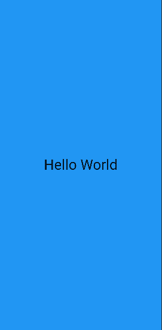
gambar tersebut adalah hasil dari contoh code yang saya dapatkan dari modul flutter yang di berikan
di dalam nya terdapat code yang menampilkan teks "Hello World" yang terdapat style untuk mendekorasi text tersebut
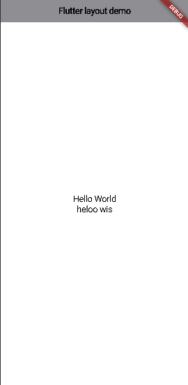
gambar tersebut  adalah hasil dari saya menggunakan code dari flutter modul yang di berikan.
code yang saya gunakan bermaksyd untuk membuat collumn atau membuat baris menjadi ke bawah saya membuat nya pada file main
dartuntuk conroh code yang saya tulis ada di bawah
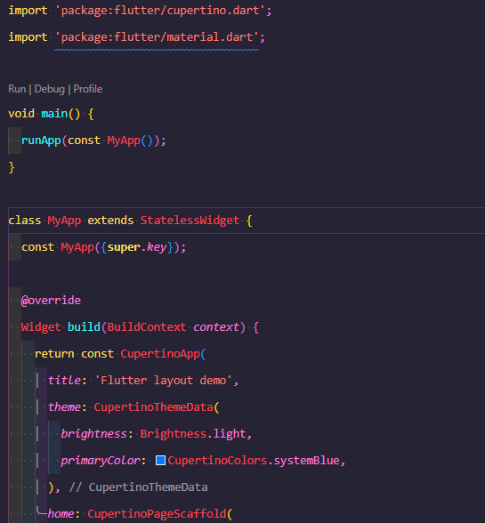
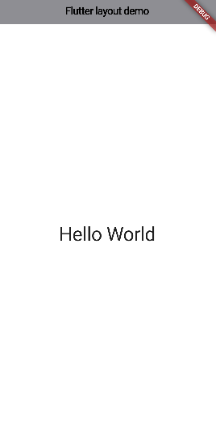
gambar tersebut addalah hasil dari saya menggunakan code dari flutter modul yang di berikan.
di code tersebut saya mentyimpulkan bahwa code yang digunakan untuk membuat style pada importan
dan menambahkan style untuk menambahkan style center pada teks atau yang lain nya.
untuk code nya ada di bawah:
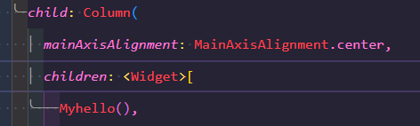

gambar tersebut adalah penampilan gambar secara row yang saya buat dengan menggunakan code flutter yang di berikan
untuk code nya ada di bawah:
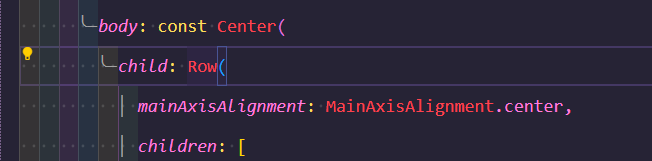

gambar tersebut adalah penampilan gambar menggunakan column yang saya buat dengan menggunakan code flutter yang di berikan
untuk code nya ada di bawah:
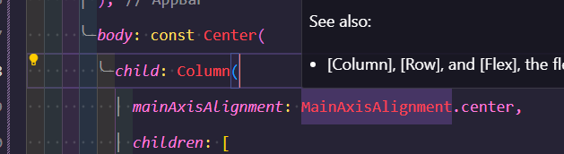

gambar tersebut adalah penampilan dari code yang telah di saya coba dan ini adalah berfungsi
sebagai spasi device untuk mengontrol agar gambar tidak terlewat dalam layar
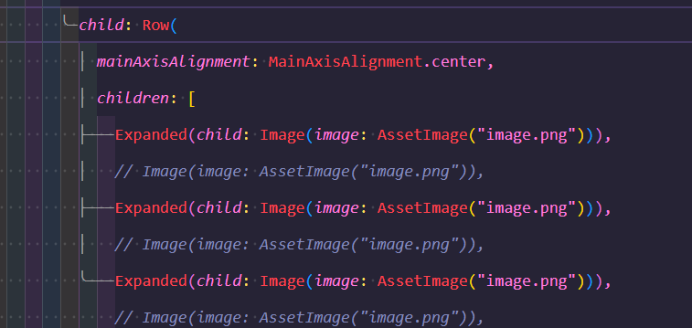
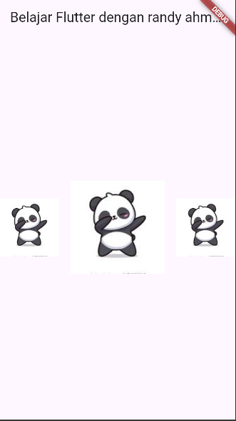
gambar tersebut adalah penampil dari code yang telah saya gunakan di dalam flutter nya
di code tersebut digunakan untuk mengontrol gambar di dalam layar
contoh code nya ada di bawah:
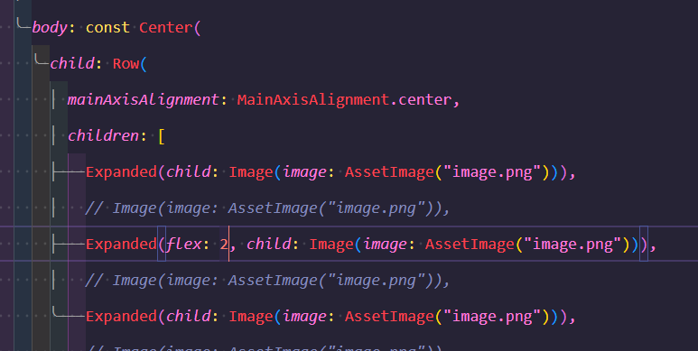
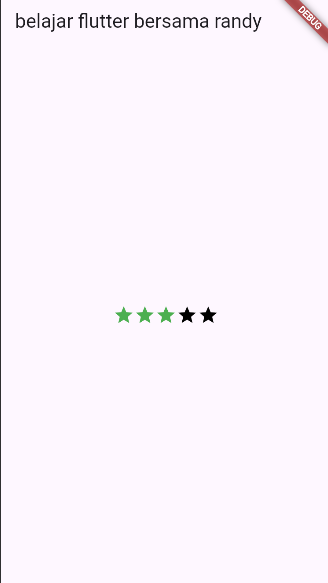
kode tersebut adalah hasil dari saya menggunakan code dari flutter di dalam implementasian nya terdapat sedikit keslahan di dalam icon nya
contoh code nya ada di bawah:
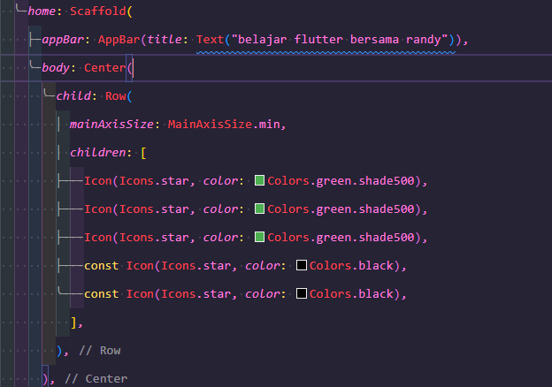
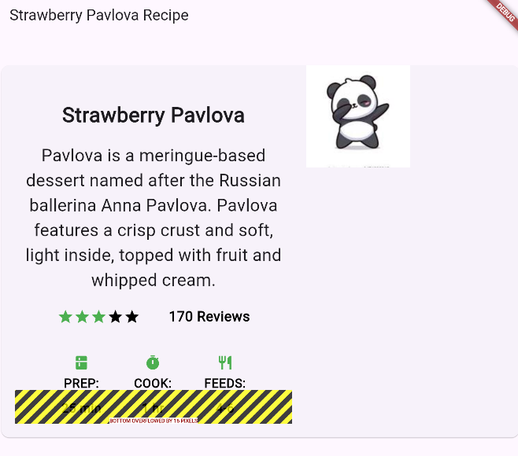
gambar terssebut adalah hasil dari saya implementasikan code dari flutter yang menampilkan gambar rating deskripsi dan lain nya
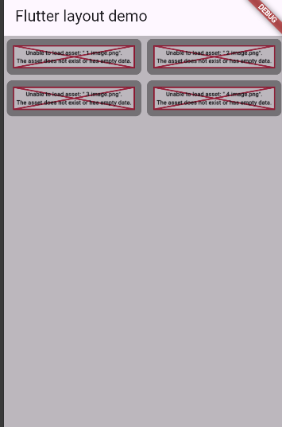
gambar tersebut adalah hasi dari saya menggunakan code dari flutter yang menampilkan gambar dengan menggunakan container yang nanti nya akan di tampilkan di dalam layar menjadi 4
